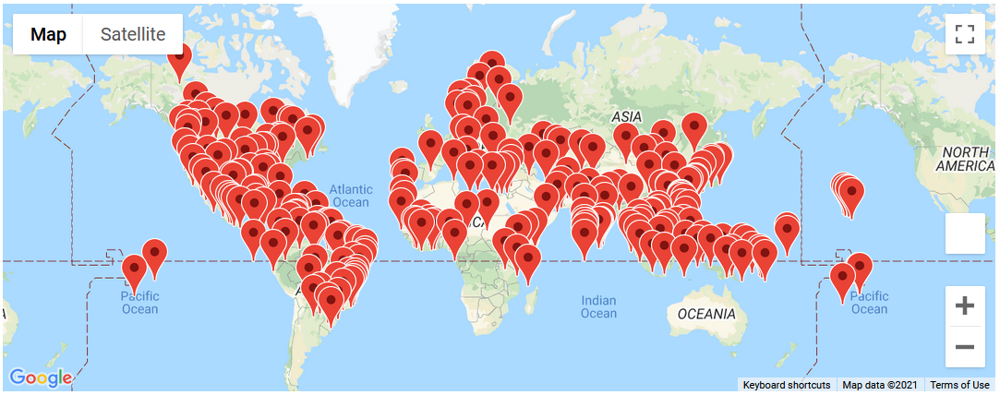
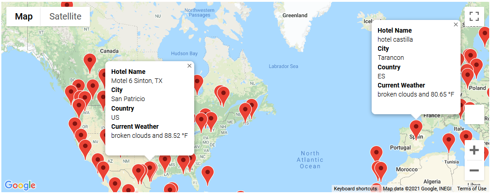
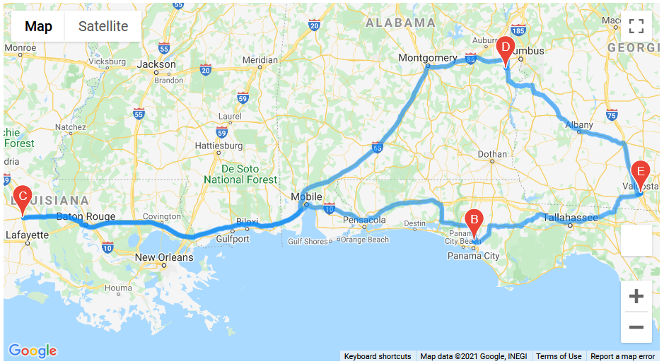

# Module 06 Challenge - PlanMyTrip

## Overview

The purpose of this project was to aid the team in the development of the PlanMyTrip App.

The project was divided into Three main segments:

1. Weather Data Collection
2. Creation of a Customer Travel Destinations Map
3. Creation of a Travel Itinerary Map

### Resources

- Data Source(s): Python User-Generated, OpenWeather Current Weather API, Google Maps Geo-location APIs (Places, Directions)
- Software: Jupyter notebook server 6.3.0, running Python 3.7.10 64-bit
	- Dependencies: citipy, gmaps, matplotlib, numpy, os, pandas, requests

### Data Quality
The feedstock data for this project relies on Commercial Providers at the Back End, namely OpenWeather and Google. A quick examination of the data retrieved reveals no glaring errors or inconsistencies. Some of the results for names of Hotels present in the Travel Destinations Map contain non-Latin Characters. For any subsequent analysis using these data, character encoding should be closely monitored and properly applied.

## 1. Weather Data Collection (Weather_Database)

To get a broad representation of weather across the globe where our customers may desire to travel, a test set of 2,000 randomly-generated Latitude and Longitude locations were generated.

The Python citipy Module was used to find the nearest city to each of these locations. Since some points would have the same nearest city, duplicates were collapsed to a single entry. This process yielded 782 randomly-selected cities across the globe.

As a point of reference, the names and countries of the cities returned correspond to a version of the Maxmind Free World Cities Database retrieved and archived in 2016 that is incorporated in the citypy internals as `worldcities.csv`. `worldcities.csv` contains discrete Latitude and Longitude point locations for 46,832 unique human-inhabitated settlements in 208 countries, on Earth, with 2016 populations greater than 500.

These cities in turn were correlated to cities having available Current Weather data from OpenWeather. Current Weather was obtained for 713 Cities on July 13, 2021.

To simplify the rest of the App Development, and to facilitate ease of testing, these results were saved locally to disk in CSV Format (`WeatherPy_Database.csv`). This static data file was used as an Input for the remainder of the project.

In a future, live product scenario, the OpenWeather API would be directly mated to the App Front-End for continuously-updating Weather Conditions.

## 2. Customer Travel Destinations Map (Vacation_Search)

Now, the exciting part! Among the 713 potential destinations, our customers are able to specify a preference for Maximum and Minimum preferred temperatures during their vacation to aid in their search. During the testing phase, we have done this for them with a Minimum trip temperature of 75 deg F and Maximum trip temperature of 90 deg F.

Once selected, the Google Maps Places API is consulted to find the Nearest Hotel for each city that meets the criteria. If a Hotel is not found for a given city, it is dropped from the results. In our test case, there were 257 remaining temperate City+Hotel Combinations to choose from.

These potentials are then displayed on a clickable, user-interactive Google Map with Markers. On click, a brief description is displayed, including the Hotel Name, City Name, Country, and Current Weather.

An example of what this looks like can be seen below in Figures 1 and 2:

Figure 1: Vacation_Search Overview Map

Figure 2: Clicked Markers Example

## 3. Travel Itinerary Map (Vacation_Itinerary)

Taking this idea even further, customers can specify 4 nearby cities within a given country to map out a driving loop between them.

With these 4 locations as inputs, the Google Maps Directions API is consulted to generate a set of directions for a driving loop, as can be seen below in Figure 3.

Figure 3: Example Driving Loop

